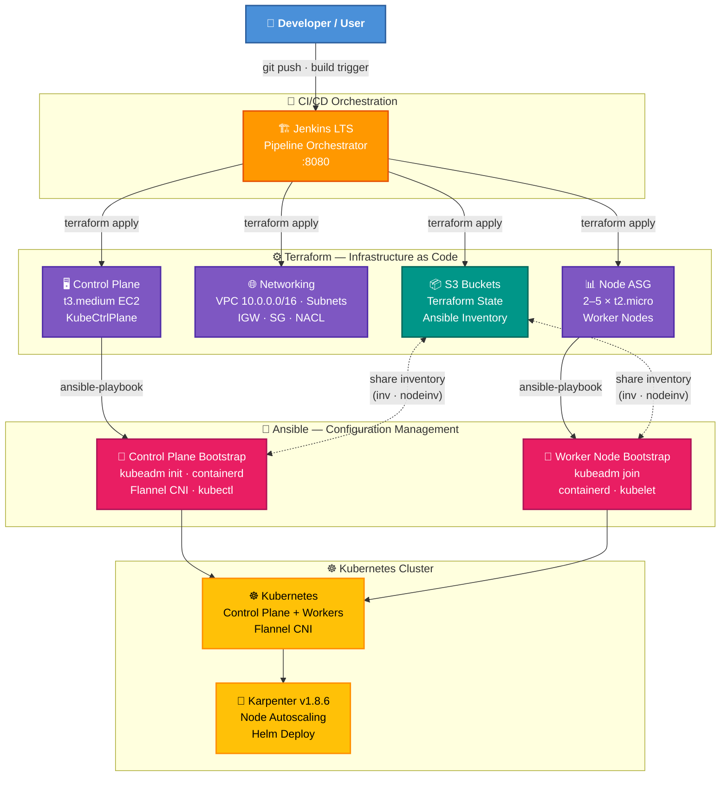

<div align="center">

# ☸️ ec2kube

**Self-Managed Kubernetes on AWS EC2 — Fully Automated**

Provision, bootstrap, upgrade, and scale a production-ready Kubernetes cluster on AWS EC2 using **Terraform**, **Ansible**, and **Jenkins CI/CD**. Includes **Karpenter v1.8.6** node autoscaling and an **EKS modernization** path.


</div>

---

## ✨ Key Features

| | Feature | Description |
|---|---|---|
| 🏗️ | **End-to-End Automation** | Single Jenkins pipeline takes you from zero to a running cluster |
| ☁️ | **AWS-Native Infrastructure** | VPC, subnets, security groups, NACLs, and ASGs via Terraform |
| ☸️ | **kubeadm Kubernetes** | Production-grade cluster initialization with Flannel CNI |
| 🚀 | **Karpenter Autoscaling** | Dynamic node provisioning with Karpenter v1.8.6 via Helm |
| 🔄 | **Safe Upgrade Runbooks** | Ansible roles for rolling kubeadm upgrades with preflight checks |
| 📦 | **EKS Modernization Path** | Ready-to-use migration to managed Amazon EKS (see [`eks/`](eks/README.md)) |
| 🔒 | **Security Defaults** | NACL + Security Group layered firewall, containerd runtime, no Docker |

---

## 🏛️ Architecture



### Component Overview

| Layer | Tool | Color | What it does |
|:---:|---|:---:|---|
| 🔵 | **Developer** | Blue | Triggers the pipeline via git push or manual Jenkins build |
| 🟠 | **Jenkins CI/CD** | Orange | Orchestrates all stages end-to-end via `Jenkinsfile` |
| 🟣 | **Terraform** | Purple | Provisions AWS infrastructure — networking, EC2, ASG |
| 🟢 | **S3 Storage** | Teal | Terraform state backend + Ansible inventory sharing |
| 🩷 | **Ansible** | Pink | Bootstraps nodes — `kubeadm init`, `kubeadm join`, containerd |
| 🟡 | **Kubernetes** | Gold | Running cluster with Flannel CNI and Karpenter autoscaling |

---

## 🚀 Quick Start

```bash
# 1. Clone
git clone https://github.com/ashir321/ec2kube.git
cd ec2kube

# 2. Fill in placeholders (search for <…> tokens)
#    See the Setup section below for details

# 3. Add AWS credentials to Jenkins
#    → awsaccesskey  → awssecretkey

# 4. Create a Jenkins pipeline job pointing to Jenkinsfile

# 5. Run with:
#    FIRST_DEPLOY = Y   (first time only)
#    TERRADESTROY = N
#    SKIP         = N
```

> 💡 **Want managed EKS instead?** See the [EKS Modernization Guide](eks/README.md) for a zero-touch Amazon EKS deployment with Karpenter and Pod Identity.

---

## 📋 Prerequisites

| Requirement | Details |
|---|---|
| **Jenkins** | Instance with the pipeline plugin; SSH key at `/var/lib/jenkins/id_rsa` |
| **Terraform** | ≥ 1.x installed on Jenkins agent |
| **Ansible** | ≥ 2.12 installed on Jenkins agent (`ansible --version` must pass) |
| **Helm** | ≥ 3.x installed on control-plane node (for Karpenter) |
| **AWS credentials** | Stored in Jenkins as `awsaccesskey` and `awssecretkey` (ID-based credentials) |
| **SSH key pair** | Public key pasted into `instances/main.tf` and key name set in `node_asg/main.tf` |
| **AWS region** | `us-east-1` (hard-coded; change all `region` values to override) |

---

## ⚙️ Setup

### 1. Fork / Clone this repository

```bash
git clone https://github.com/ashir321/ec2kube.git
cd ec2kube
```

### 2. Create an S3 bucket for Terraform state

Pick a globally unique name, e.g. `my-ec2kube-tfstate`.
This **same name** must be used in the next step and in the Jenkinsfile.

### 3. Fill in all placeholder values

Search for `<…>` tokens and replace them:

| File | Placeholder | Replace with |
|---|---|---|
| `Jenkinsfile` | `<bucket_name>` | Your Terraform state bucket name |
| `Jenkinsfile` | `<ansible_bucket>` | Name for the Ansible inventory S3 bucket (created by Terraform) |
| `ansible_infra/infra.tf` | `<bucket_name>` (backend) | Terraform state bucket name |
| `ansible_infra/infra.tf` | `<state_file_name>` | e.g. `ansible-infra.tfstate` |
| `ansible_infra/variables.tf` | `<bucket_name>` | Ansible inventory S3 bucket name |
| `networking/networking.tf` | `<bucket_name>` | Terraform state bucket name |
| `networking/networking.tf` | `<state_key>` | e.g. `networking.tfstate` |
| `instances/main.tf` | `<bucket_name>` | Terraform state bucket name |
| `instances/main.tf` | `<state_name>` | e.g. `instances.tfstate` |
| `instances/main.tf` | `<ssh_key>` | Your SSH public key string (`ssh-rsa AAAA…`) |
| `node_asg/main.tf` | `<state_bucket>` | Terraform state bucket name |
| `node_asg/main.tf` | `<state_key>` | e.g. `node-asg.tfstate` |
| `node_asg/main.tf` | `<ssh_key_name>` | AWS key pair name to attach to worker nodes |

### 4. Add AWS credentials to Jenkins

In **Jenkins → Manage Credentials**, create two **Secret text** credentials:

- ID `awsaccesskey` → your `AWS_ACCESS_KEY_ID`
- ID `awssecretkey` → your `AWS_SECRET_ACCESS_KEY`

### 5. Create a Jenkins pipeline job

1. **New Item → Pipeline**
2. Under **Pipeline**, choose **Pipeline script from SCM**
3. Set SCM to **Git** and point to this repository
4. **Script Path**: `Jenkinsfile`
5. Save

---

## 🔄 Running the Pipeline

### Full first-time deployment

Set the following pipeline environment variables (editable at the top of the `Jenkinsfile` or as Jenkins build parameters):

```
FIRST_DEPLOY = Y   # creates the Terraform state S3 bucket
TERRADESTROY = N
SKIP         = N
```

Trigger a build. The pipeline stages run in order:

| Stage | Name | What happens |
|:---:|---|---|
| 1 | **Create Terraform State Bucket** | `aws s3 mb` the state bucket (first deploy only) |
| 2 | **Deploy Ansible Infra** | Terraform creates the private Ansible inventory S3 bucket |
| 3 | **Deploy Networking** | Terraform creates VPC, subnets, SG, NACL, IGW, route tables |
| 4 | **Deploy Controlplane** | Terraform launches the `t3.medium` EC2 instance; Ansible discovers DNS, uploads `inv` to S3, runs `kubeadm init`, verifies `kubectl` |
| 5 | **Launch Nodes** | Terraform deploys the ASG; Ansible generates `kubeadm join` token, discovers worker DNS, uploads `nodeinv` to S3, runs `kubeadm join` on every worker |

### Subsequent deployments (no state bucket re-creation)

```
FIRST_DEPLOY = N
TERRADESTROY = N
SKIP         = N
```

### Tearing everything down

```
TERRADESTROY = Y
```

This destroys resources in reverse order: Ansible S3 bucket → EC2 instances → ASG → Networking → Terraform state bucket.

---

## 📈 Kubernetes Upgrade Runbook (kubeadm)

The `kubeadm_upgrade` role automates safe Kubernetes upgrades on EC2-hosted kubeadm clusters. It follows the official kubeadm upgrade sequencing:

1. Upgrade first control-plane node → `kubeadm upgrade apply`
2. Upgrade additional control-plane nodes → `kubeadm upgrade node`
3. Upgrade worker nodes → `kubeadm upgrade node`

### Key variables

Set these via `group_vars/all.yml` or `--extra-vars`:

| Variable | Description | Example |
|---|---|---|
| `kubernetes_target_version` | Full package version string | `1.35.4-1.1` |
| `kubernetes_target_minor` | Minor version for the pkgs.k8s.io repo | `v1.35` |
| `kubernetes_target_semver` | Semantic version for `kubeadm upgrade apply` | `v1.35.4` |
| `drain_timeout` | Drain timeout in seconds | `300` |
| `drain_grace_period` | Drain grace period in seconds | `30` |
| `control_plane_serial` | How many CP nodes to upgrade at once | `1` |
| `worker_serial` | How many workers to upgrade at once | `1` |

### Staging example

```bash
cd ansible_infra/ansible_role

# 1. Upgrade control-plane nodes
ansible-playbook upgrade_control_plane.yml -i inv \
  -e kubernetes_target_version=1.35.4-1.1 \
  -e kubernetes_target_minor=v1.35 \
  -e kubernetes_target_semver=v1.35.4 \
  --check --diff  # dry-run first

ansible-playbook upgrade_control_plane.yml -i inv \
  -e kubernetes_target_version=1.35.4-1.1 \
  -e kubernetes_target_minor=v1.35 \
  -e kubernetes_target_semver=v1.35.4

# 2. Upgrade worker nodes (combine inventories for drain delegation)
ansible-playbook upgrade_workers.yml -i inv -i nodeinv \
  -e kubernetes_target_version=1.35.4-1.1 \
  -e kubernetes_target_minor=v1.35 \
  -e kubernetes_target_semver=v1.35.4
```

### Production example (with serial=1 and verbose)

```bash
ansible-playbook upgrade_control_plane.yml -i inv \
  -e kubernetes_target_version=1.35.4-1.1 \
  -e kubernetes_target_minor=v1.35 \
  -e kubernetes_target_semver=v1.35.4 \
  -e control_plane_serial=1 \
  -v

ansible-playbook upgrade_workers.yml -i inv -i nodeinv \
  -e kubernetes_target_version=1.35.4-1.1 \
  -e kubernetes_target_minor=v1.35 \
  -e kubernetes_target_semver=v1.35.4 \
  -e worker_serial=1 \
  -v
```

### Preflight checks

The upgrade role automatically validates:
- Current vs target Kubernetes version
- No minor-version skipping (e.g. 1.30 → 1.32 is blocked)
- No downgrades
- Node readiness before upgrade

### Post-upgrade validation

```bash
kubectl get nodes -o wide
kubectl get pods -A
kubeadm upgrade plan
kubectl get pods -n kube-system -o wide
```

---

## 🚀 Karpenter v1.8.6 Upgrade Runbook

The `karpenter` role manages Karpenter installation and upgrades via Helm.

> **⚠️ IMPORTANT**: Karpenter v1.8.4 is NOT used due to known issues. This repo pins to **v1.8.6**.

### Prerequisites

1. Helm 3.x installed on the control-plane node
2. Karpenter IAM role created (for IRSA or pod identity)
3. SQS interruption queue created (if using interruption handling)
4. Karpenter CRDs must be v1 (not v1beta1). If upgrading from <1.0, migrate first.

### Key variables

| Variable | Description | Example |
|---|---|---|
| `karpenter_version` | Karpenter chart version | `1.8.6` |
| `karpenter_cluster_name` | K8s cluster name | `my-cluster` |
| `karpenter_cluster_endpoint` | API server endpoint | `https://10.0.1.100:6443` |
| `karpenter_iam_role_arn` | IAM role ARN for controller | `arn:aws:iam::123456789012:role/KarpenterRole` |
| `karpenter_interruption_queue_name` | SQS queue name | `my-cluster-karpenter` |
| `karpenter_namespace` | K8s namespace for Karpenter | `karpenter` |

### Install/Upgrade Karpenter

```bash
cd ansible_infra/ansible_role

ansible-playbook upgrade_karpenter.yml -i inv \
  -e karpenter_cluster_name=my-cluster \
  -e karpenter_cluster_endpoint=https://10.0.1.100:6443 \
  -e karpenter_iam_role_arn=arn:aws:iam::123456789012:role/KarpenterControllerRole \
  -e karpenter_interruption_queue_name=my-cluster-karpenter
```

### Post-upgrade validation

```bash
kubectl get pods -n karpenter -o wide
helm list -n karpenter
kubectl get crd | grep karpenter
kubectl get nodepools
kubectl get ec2nodeclasses
kubectl get nodeclaims
```

---

## 📁 Repository Structure

```
ec2kube/
│
├── Jenkinsfile                              # CI/CD pipeline — EC2 self-managed K8s
├── Jenkinsfile.eks                          # CI/CD pipeline — EKS modernized
│
├── networking/                              # Terraform — VPC, subnets, SG, NACL
│   ├── networking.tf
│   ├── output.tf
│   └── variables.tf
│
├── instances/                               # Terraform — control-plane EC2 instance
│   ├── main.tf
│   ├── outputs.tf
│   └── variables.tf
│
├── node_asg/                                # Terraform — worker node Auto Scaling Group
│   ├── main.tf
│   ├── outputs.tf
│   └── variables.tf
│
├── ansible_infra/
│   ├── infra.tf                             # Terraform — Ansible inventory S3 bucket
│   ├── variables.tf
│   │
│   ├── ansible_playbooks/                   # Ad-hoc playbooks (inventory, token, test)
│   │   ├── identify_controlplane.yml
│   │   ├── identify_nodes.yml
│   │   ├── main_kubeadm_token.yml
│   │   ├── bootstrap_node.yml
│   │   └── testkubectl.yml
│   │
│   └── ansible_role/                        # Ansible roles and upgrade playbooks
│       ├── main.yml                         #   → kubeadm init (control plane)
│       ├── kubenode.yml                     #   → kubeadm join (workers)
│       ├── upgrade_control_plane.yml        #   → rolling CP upgrade
│       ├── upgrade_workers.yml              #   → rolling worker upgrade
│       ├── upgrade_karpenter.yml            #   → Karpenter install/upgrade
│       ├── group_vars/all.yml               #   → centralized version defaults
│       │
│       ├── kubecontrolplane/                # Role: kubeadm init + kubectl setup
│       ├── kubenodes/                       # Role: kubeadm join
│       ├── kubeadm_upgrade/                 # Role: safe kubeadm upgrade automation
│       └── karpenter/                       # Role: Karpenter v1.8.6 via Helm
│
└── eks/                                     # EKS modernization path
    ├── deploy-eks.sh                        #   → zero-touch EKS deployment
    ├── teardown-eks.sh                      #   → safe teardown
    ├── env.conf                             #   → configuration
    ├── manifests/                            #   → EC2NodeClass, NodePool, test workload
    └── README.md                            #   → full EKS documentation
```

---

## 🌐 Ports and Networking

| Port | Protocol | Purpose |
|:---:|:---:|---|
| 22 | TCP | SSH (Ansible management) |
| 80 | TCP | HTTP |
| 443 | TCP | HTTPS |
| 6443 | TCP | Kubernetes API server |
| 1024–65535 | TCP | Ephemeral / return traffic (NACL) |

---

## ↩️ Rollback Notes

### Kubernetes rollback
- kubeadm does **not** support downgrading. If an upgrade fails mid-way:
  1. Fix the issue on the failing node (do not proceed to other nodes)
  2. If kubelet fails to start, check `journalctl -u kubelet`
  3. As a last resort, re-provision the node from scratch
- Always test upgrades in staging first

### Karpenter rollback
```bash
# Roll back to previous version
helm rollback karpenter -n karpenter

# Or pin to a specific version
helm upgrade karpenter oci://public.ecr.aws/karpenter/karpenter \
  --version <previous-version> --namespace karpenter --values /tmp/karpenter-values.yml
```

---

## 📌 Open Assumptions

1. **Single control-plane**: The current setup uses one control-plane node. The upgrade playbooks support multi-CP but the Terraform only provisions one.
2. **Ubuntu-based nodes**: The primary automation targets Ubuntu (Debian). RedHat support is included but not tested.
3. **containerd runtime**: The updated roles use containerd directly instead of Docker. Existing Docker-based nodes should work if Docker's containerd socket is available.
4. **Karpenter IRSA**: The Karpenter role assumes IRSA or pod-identity is configured externally. The IAM role must be created separately.
5. **Flannel CNI**: The control-plane role installs Flannel. If using a different CNI, modify `install_kubernetes.yml`.
6. **Package versions**: The `kubernetes_target_version` format (e.g. `1.35.4-1.1`) follows the pkgs.k8s.io convention. Verify the exact available version with `apt-cache madison kubeadm`.
